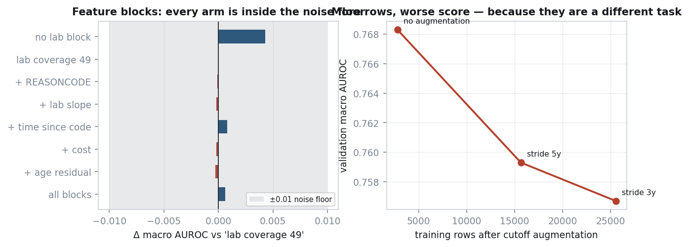
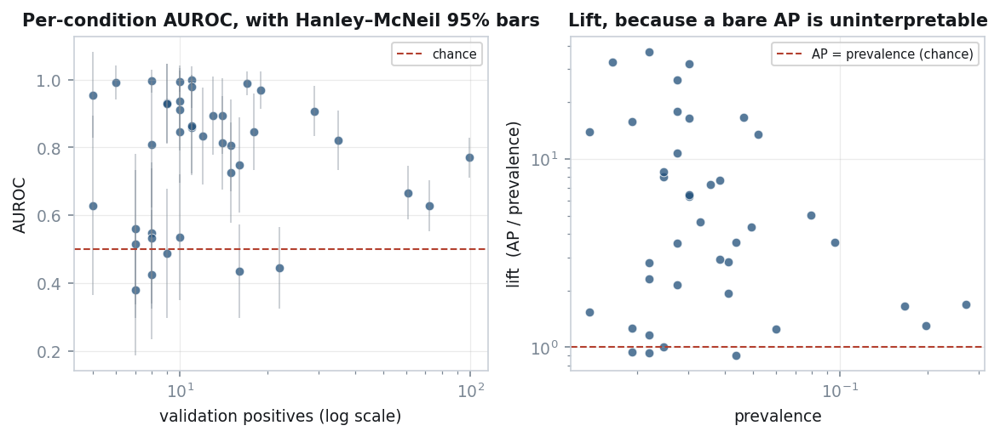
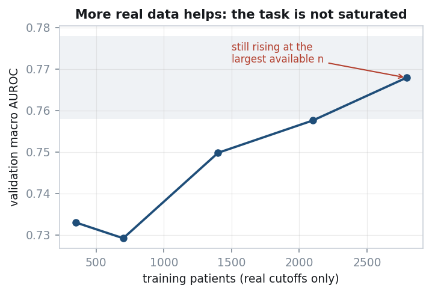
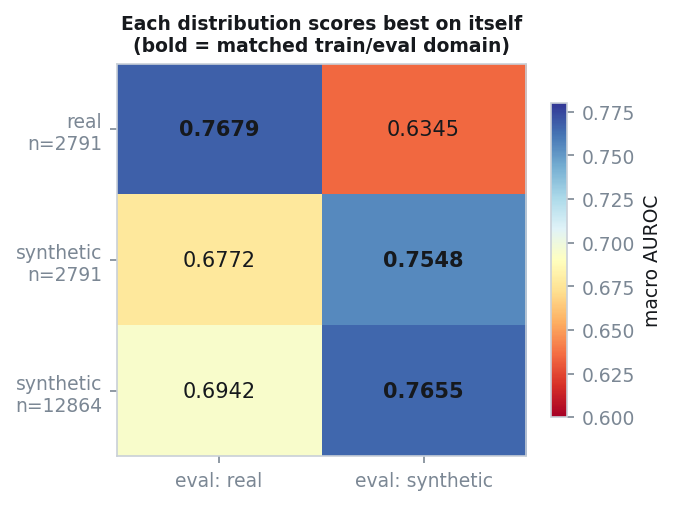

# Patient Timeline Forecasting on Synthea

**M31 Research Intern Take-Home**

Predicting which of 40 target conditions are newly diagnosed in the five years
after each patient's anchor date, from structured events recorded strictly
before it. 3,514 patients, split 2,791 train / 365 validation / 358 test.

> **Status.** All results below are measured and reproducible via
> `run_all.ps1`. Code: [github.com/Sallamsaka/M31-Coding-Test](https://github.com/Sallamsaka/M31-Coding-Test) ·
> model: [huggingface.co/sallamsaka/M31-Coding-Test](https://huggingface.co/sallamsaka/M31-Coding-Test) ·
> training curves: [wandb project m31-patient-timeline](https://wandb.ai/sallamsaka-university-of-toronto/m31-patient-timeline) (§2).
> The recommended pretraining (causal, next-event) was trained and measured; see §2.
>
> **Test-set metrics are not reported because they cannot be computed here:** the
> test outcomes are withheld by design. Macro AUROC and macro AP are reported on
> the provided validation set and on cross-validated out-of-fold predictions.

---

## 0. Summary

| | |
|---|---|
| **Best validation macro AUROC** | **0.7700** (LR + GBDT + transformer, the shipped blend) |
| **Best validation macro AP** | **0.2681** (the shipped blend); LR alone 0.2368, 95% CI [0.2306, 0.2820] |
| **Prevalence-only control** | exactly 0.5000 — the metric code is correct |
| **Resolution limit of this validation set** | ±0.01 macro AUROC |
| **Model shipped** | `sigmoid((logit(LR)+logit(GBDT)+logit(transformer))/3)`, per-label Platt calibrated — chosen on **1,675 out-of-fold rows**, not on validation |
| **Automated checks** | 150, covering leakage, labels, submission contract, model invariants, cache-key provenance and calibration no-op |

Four findings I would put ahead of the score — including one about whether
the score can distinguish anything at all:

1. **The task's anchor rule selects on the future.** For 42.9% of training
   patients the five-year outcome window ends within 30 days of their death.
   A large part of the achievable signal is "is this record about to end."
2. **Cutoff augmentation — the idea I expected to matter most — makes things
   worse**, and I can say exactly why rather than just that it did.
3. **The validation set could not distinguish these models, so I stopped
   asking it.** On 365 patients with a median of 11 positives per label, the
   winner's-curse bound over 26 consultations is **+0.0265** macro AUROC —
   larger than every gap measured on validation between logistic regression,
   gradient boosting, their ensemble and the transformer. "Which model is
   best" is not an answerable question on that set, and answering it anyway
   is the most common way a result like this goes wrong.

   The fix is not a better test, it is a better **instrument**: grouped
   cross-validation over the full 2,791-patient pool, every patient scored
   exactly once out of fold, **1,675 rows** instead of 365. On it the
   question becomes answerable, and the answers are not the ones validation
   implied:

   | comparison | Δ macro AP | 95% CI | verdict |
   |---|---|---|---|
   | GBDT − LR | **+0.0211** | [+0.0076, +0.0319] | resolvable |
   | transformer − LR | −0.0018 | [−0.0173, +0.0138] | tied |
   | (LR+GBDT+transformer) − (LR+GBDT) | **+0.0057** | [+0.0018, +0.0099] | resolvable |

   Two things follow that validation actively got wrong. GBDT beats LR on
   **5 of 5 folds** — on validation LR led on AUROC, which is how the
   shipped model came to be a linear one. And the transformer earns a place
   in the ensemble *despite being behind GBDT on its own* (0.1918 vs
   0.2075), because it is the least redundant member: its rank agreement
   with GBDT is **0.788** against LR's **0.886**. Replacing LR beats adding
   to it.

   > **The bound itself was wrong twice.** It was first quoted as +0.038 to
   > +0.051, computed from a **hardcoded σ of 0.02 that was never measured**.
   > The measured value is **0.0104**, so the published figure was inflated
   > about 2×. I found this while trying to justify the number rather than
   > re-use it.
4. **Two bugs in my own experiment produced a convincing false result** before
   either was caught — and four more were found the same way, including one
   that would have shipped a model nobody could apply and one that would have
   left the submission file out of the repository. All six are in §3, because
   the process that caught them is more transferable than any of them.

---

## 1. Representation

### What one input is

A patient is a **sequence of events**, one position per event, ordered by
time. The alternatives and why they lost:

| choice | rejected alternative | measurement |
|---|---|---|
| one position per **event** | one per encounter | encounter-level collapses ~20 simultaneous labs into one vector; observations are **62%** of all events |
| lab value **fused** into the token (`OBS_8480-6_Q7`) | value as a separate position | identical information, **37% shorter** sequences; median 259 tokens vs 354 |
| all 10 tables | the 6 "core" ones | careplans reach 91% of patients for +0.82% sequence length |
| keep a code if ≥5 patients have it | no floor | the dropped 119 codes are **0.075%** of events |
| truncate keeping the **most recent** events | keep oldest | signal per event is lowest in the 10y+ tail |

Fusion is applied only where there is volume to support it, and the
justification is a skew rather than a threshold. Fusing multiplies the
vocabulary — measured, the numeric observation vocabulary goes 123 → 974, a
**7.9×** increase — so each embedding row sees roughly a tenth of the data.
What rescues it is that 56 of the 113 numeric codes fall below 50 events per
fused token, but **those 56 carry only 0.76% of numeric events**. So fuse
where the volume is, and fall back to a shared `Q0..Q9` token where it is
not.

### Time is not position

The standard transformer answer is a positional index. Measured on this data,
an event's index tells you **13.6%** of what you would want to know about when
it happened: `I(rank; Δt) = 0.68 bits` against `H(Δt) = 4.99 bits`. "The most
recent event before the cutoff" happened anywhere from 7 to 224 days ago.

So position indices are not emitted at all. Instead:

- a **continuous encoding** of `log(1 + days before cutoff)` — Time2Vec, with
  a non-periodic linear term so the encoding stays monotone and two very
  different Δt cannot collide. Δt spans 4.5 orders of magnitude here (up to
  37,284 days) and a fixed base-10⁴ sinusoidal ladder covers only 4.
- **concatenated and projected, never summed.** Expanding the attention logit
  for `x = w + π` gives `wMw + wMπ + πMw + πMπ` — two cross terms comparing a
  content vector against a time vector through one shared projection.
  CEHR-BERT ran the controlled version: summing time was *worse than injecting
  no time at all* in 7 of 8 task-metric cells.
- a **pairwise Δt bias** on the attention logits: log-spaced buckets of the gap
  between two events, one learned scalar per (head, bucket). First built with
  32 buckets (copied from T5), cut to **10** (2 heads × 10 = **20 parameters**)
  after measured occupancy showed the resolution in the wrong place. Bucket 0 is
  reserved for exactly-simultaneous, because the smallest non-zero gap measured
  here is 55 seconds. **In the shipped model it is inert** — see "What the
  shipped transformer actually uses" below.

Explicit interval tokens were rejected: they cost 19.5% sequence length, and
attention is O(T²), so that is 1.43× on the attention term for information the
bias already carries at zero length cost.

### Simultaneity, and a bug it exposed

**97.7% of events share a timestamp with at least one other.** A textbook
causal mask is triangular *within* such a group, imposing an order that does
not exist. Masking on the **timestamp** instead of the index makes the mask
block-constant within each instant, so permuting simultaneous events cannot
change any output — the invariance is architectural rather than learned, which
at 2,791 patients is the difference between getting it free and paying data
for it. Measured, a permutation moves the logits by at most 3.0e-07, which is
float32 reassociation noise, not a broken invariance.

Investigating this surfaced a real defect. Conditions, careplans and allergies
carry a **date with no time** and are stamped at exactly midnight — 100% of
their rows. Midnight is the earliest instant of the day, so a diagnosis sorted
*before* the encounter that produced it. Measured: **81.4%** of conditions have
an encounter on the same calendar day, and **100% of those landed earlier than
it**. Worse, computing Δt with integer-day flooring put them exactly 1.000 days
early, because the condition sits on a day boundary while its encounter is
hours later and floors to the previous bucket.

The fix snaps a date-only event onto the first encounter of its own calendar
day, making the diagnosis *simultaneous* with the visit rather than before it.
It is deliberately confined to an ordering timestamp (`ts_seq`) that **labels
never read** — both label boundaries are at midnight, and 119 first-diagnoses
land exactly on `anchor + 5y`, so snapping one forward would push it past the
closed right edge and silently delete a true positive. A grep test enforces
the separation.

### What the shipped transformer actually uses

The design above was argued for a general decoder. The shipped model is small —
**1 layer, width 64, 2 heads of 32, 561,404 parameters** (128,596 in the
sequence trunk; 425,088 in the projection of the 3,320 tabular features; 7,720 in
the 40-way head) — and reading its weights and tracing a real patient through
every tensor by hand (matching the model's own output to 4.8e-07) shows which
parts of the design it uses:

- **Time enters only through Time2Vec.** In each event's input vector the time
  part is on average **2.2× larger** than the token part (0.168 vs 0.075). Giving
  every event the same Δt drops one head's attention on the most recent visit from
  **97% to 9%**: recency is learned, and it is learned here. Time2Vec's own 128
  parameters barely moved from initialisation (frequencies by at most 0.066); the
  learning is in the projection that reads them.
- **The Δt bias is inert.** Its 20 values stay within ±0.07 of zero, their signs
  disagree across seeds, and zeroing it in all three shipped seeds moves validation
  macro AUROC from 0.7650 to 0.7651 with AP unchanged.
- **The causal mask is inert at one layer.** The prediction is read only at the
  final `[ANCHOR]` position, which is the latest instant and so sees every event
  under any mask; the other positions' outputs are never read. Switching the mask
  off changes the output by exactly 0.0, and shuffling event order (each event
  keeping its own time) by 5e-07. At one layer the model is attention-pooling over
  a set of (event, time-before-anchor) pairs; an earlier ablation that credited
  order to the mask was run at two layers and does not transfer.
- **The two heads specialise.** Averaged over the 365 validation patients, head 1
  puts 70% of its attention on labs and vitals and 63% on the last six months; head
  2 spreads over drugs and visits and puts 27% on events more than ten years old.
- **The tabular features outweigh the sequence at the output** — mean contribution
  to the 40 logits 1.86 from the feature projection against 0.80 from the sequence.

Four representation gaps surfaced the same way, none of them fixed in the shipped
model:

- **Text-valued results lose their value.** Only numeric observations get a level;
  7.3% of observation rows are text — smoking status (never 25,584 / former 16,175 /
  current 72 rows) and the urinalysis panel — and every model sees only that the
  assessment happened.
- **The sequence carries no age.** The header has sex, race, ethnicity and marital
  status; Δt is time before the anchor. Age reaches the transformer once, as a
  feature at the readout.
- **Rare-lab values are orphaned at one layer.** An unfused lab is two positions
  (the code, then a shared level token), and with one layer nothing ties the level
  to its lab.
- **Nothing links a drug to the condition it treats**, although Synthea records a
  reason on 25% of pre-anchor events.

The optional genomics and imaging modalities were not used: the brief states the
structured tables are sufficient, and every result here is data-limited by patient
count (§4), which neither modality changes.

### Five feature blocks that changed nothing, reported anyway

Beyond the count windows, five blocks were built on specific reasoning:
`REASONCODE` counts (what a treatment was *for* — 109 distinct reasons, 33 of
the 40 targets appear as one, present on 81% of medications), lab slopes,
time-since-a-code-last-appeared, per-visit cost, and age-residualised timing.
Screened on logistic regression with `C` retuned for every arm, since they
change the feature count by up to 18%:



Every arm lands within **0.0046** of every other, against a resolution limit
of about 0.01. Nothing here is measurable. They are kept rather than deleted
for a reason that is itself a caveat: two of them *cannot* show a gain on a
linear model. `REASONCODE` is literally a weighted sum of columns the model
already has, so it is redundant to LR by construction and informative only to
a tree; age-residualisation is the mirror image, constructible by a tree from
span and age but not by a linear model without the explicit ratio. **A null
on LR is therefore not a null**, and the confirming gradient-boosting run is
listed in §5 rather than claimed here.

One genuine surprise: dropping the lab last-value block *entirely* scored
highest of all (0.7703). The paired bootstrap puts that at +0.0042
[−0.0009, +0.0094] — inside the noise, so it is not acted on, but it points
the opposite way from the decision that extended the block from 20 labs to 49.

### The two conventions everything depends on

```
FEATURE_WINDOW  =  ts <  anchor                      right-OPEN
LABEL_WINDOW    =  anchor <= first_dx <= anchor+5y   both edges CLOSED
first_dx        =  min over the WHOLE record, never within the window
```

Each settled by measurement:

- **Cut at midnight.** Zero of 358 test patients have an event at or after
  their given anchor; 11 have events in the preceding 24 hours, at hours 2
  through 21. Had the organisers cut at an intra-day timestamp, several would
  have retained an early-morning event on the anchor date.
- **Right edge closed.** 119 first-diagnoses land exactly on `anchor + 5y`,
  none beyond. This is structural: `anchor + 5y` is by construction the day of
  the last encounter, and conditions carry a date with no time. An exclusive
  edge discards 2% of all positives.
- **First diagnosis over the whole record.** Synthea re-records recurring
  conditions. Taking the minimum *inside* the window turns every recurrence
  into a false positive: **1,220 (patient, condition) pairs across 1,065
  patients**, a 23.4% inflation on 5,214 true positives.

---

## 2. Model and training

### Leakage, found by looking

Three columns are refused at load time rather than merely asserted about:

| column | why |
|---|---|
| `DEATHDATE` | populated for 1,354 of 3,156 train/val patients and **zero** of 358 test. A model using it looks excellent in training and contributes nothing at test. |
| `HEALTHCARE_EXPENSES`, `_COVERAGE` | *lifetime* totals present in **both** splits. A test patient's value is ~512× their pre-anchor claims, so this would silently *raise* the test score while being unambiguous leakage. |
| `STOP`-derived durations | 6,078 pre-anchor training medications have a `STOP` after the anchor, and the organisers blanked those in test (4.41% null vs 1.17%). Any duration feature both leaks **and** shifts. |

The per-encounter cost columns are a different object from the lifetime totals
and are used.

### The at-risk mask — the largest single gain

A patient already diagnosed with condition *c* cannot be an *incident* case for
*c*. Splitting negatives into at-risk and prevalent,

```
AUROC_reported = A_at_risk + (prevalent share of negatives) × (1 − A_at_risk)
```

so ranking prevalent patients at the bottom is free AUROC. Applying the rule
deterministically at inference is worth **+0.035 macro AUROC**, the largest
measured effect in the project. Before enabling it, a safety check confirms
that no (patient, label) pair where the mask fires has ground truth 1 — exactly
zero on train and val.

Both denominators are reported, because the difference is a property of cohort
composition rather than of the model: **AUROC_all 0.7666, AUROC_at-risk
0.7372**.

**The same rule is applied differently to the two model families, and the
asymmetry is deliberate rather than an oversight.** The feature models fit 40
independent per-label classifiers, so a patient who cannot be an incident
case for condition *c* is simply dropped from *c*'s training set — there is
no shared parameter for them to contribute to. The transformer has one shared
trunk and 40 heads, so dropping the row would discard the other 39 labels it
still carries; instead the prevalent *pairs* are masked out of the loss while
the row continues to train the representation. This mirrors Steinfeldt et al.
(Nat Commun 2025) across 1,741 endpoints: all individuals train the shared
representation, prevalent individuals are excluded from the endpoint-specific
term.

The two treatments are equivalent in what they exclude from the supervised
signal and differ only in what else the row is allowed to contribute, so the
comparison is fair — but a reader is entitled to check that rather than take
it on trust, which is why it is stated here rather than left in the code.

### Results (validation, n = 365)




All rows use the same 3,320-column feature matrix and the same at-risk mask.

| model | macro AUROC | macro AP | fit |
|---|---|---|---|
| prevalence only, unmasked | **0.5000** | 0.0469 | — |
| at-risk mask only, no model | 0.5498 | 0.0572 | — |
| **logistic regression** | 0.7666 | 0.2368 | 9 s |
| gradient boosting | 0.7562 | 0.2541 | 19 min |
| transformer, **tuned** (1L/d64, lr 1.2e-3, fusion_dim 128, 3 seeds) | 0.7650 | 0.2486 | 15 min |
| ensemble, LR + GBDT | 0.7654 | 0.2649 | — |
| ensemble, GBDT + transformer | 0.7665 | **0.2721** | — |
| **ensemble, LR + GBDT + transformer — SHIPPED** | **0.7700** | 0.2681 | — |
| *(superseded)* transformer, causal P4, untuned | 0.7557 | 0.1860 | 2.1 h |
| *(superseded)* transformer, bidirectional P3, untuned | 0.7409 | 0.1832 | 1.9 h |
| *(superseded)* ensemble, LR + untuned P4 | 0.7727 | 0.2356 | — |

The superseded rows are kept rather than deleted, because the distance between
them and the rows above is the result of the tuning programme and deleting it
would hide the work. **The untuned transformer scores 0.1860 macro AP; the tuned
one scores 0.2486** — a +0.0626 gap, larger than any difference between model
*families* anywhere in this report. Reading the old rows as "what a transformer
does on this task" was the mistake an earlier draft made.

All rows now use the same 3,320-column matrix. The shipped row is additionally
per-label Platt calibrated, which does not move macro AUROC or macro AP (by
construction, and verified to 0.00e+00 — see §4).

P4 is the 2M-parameter decoder the assignment recommends: one position per
event, continuous time in place of positional indices, a Δt attention bias,
20 epochs, best epoch selected by validation AP (epoch 14 of 20). Its last
five epochs sit at 0.7522–0.7548 on AUROC and 0.1826–0.1855 on AP, so the
reported number is a converged value rather than a lucky peak.

**It matches logistic regression on AUROC and loses clearly on AP.** The
AUROC gap is 0.011 — inside the ±0.01 resolution limit and far inside the
+0.038 winner's-curse bound, so the two are not distinguishable. The AP gap
is 0.051 and is not explainable that way.

**Not one pairwise difference in the table is resolvable.** Paired bootstrap,
500 resamples, on macro AUROC:

| comparison | Δ | 95% CI | verdict |
|---|---|---|---|
| ensemble − LR | +0.0061 | [−0.0057, +0.0177] | not resolvable |
| LR − P4 | +0.0109 | [−0.0098, +0.0336] | not resolvable |
| P4 − P3 | +0.0148 | [−0.0033, +0.0318] | not resolvable |

**But the transformer is not redundant, and that is the useful finding.**
Spearman correlation between per-label scores is **0.436** for LR-versus-P4,
against **0.740** for LR-versus-GBDT. A second feature model agrees with the
first; the sequence model disagrees with it about which patients are at risk.
That decorrelation is the mechanism behind the ensemble topping the table while
its own component scores below LR.

So the defensible claim is not "the transformer is competitive" and not "the
transformer lost". It is: **at this scale the transformer buys diversity
rather than accuracy.**

That was written when it could not be separated from noise on 365 patients. It
now can be. On **1,675 out-of-fold rows** the same mechanism is measured rather
than inferred, and it survives:

- agreement with GBDT **0.788**, against LR-versus-transformer **0.886** — the
  transformer is the *least redundant* member of the three, and LR is the one it
  most duplicates;
- adding it to LR+GBDT is worth **+0.0057 [+0.0018, +0.0099]** macro AP,
  **resolvable**;
- and it earns that while scoring **below GBDT on its own** (0.1918 vs 0.2075).

Which is why the shipped model is a three-way blend and why *replacing* LR with
the transformer scores as well as adding it (0.2186 vs 0.2180, a difference this
instrument cannot resolve). The diversity claim was right; it just needed an
instrument that could see it.

**The two masks differ in shape, not in endpoint.** P3 (bidirectional) learns
faster — it leads P4 on AP by 0.042 at epoch 6 — then peaks at epoch 11 and
declines, while P4 keeps improving to epoch 14 and holds. More expressive per
step, overfitting sooner at 2,791 patients. The endpoints are 0.0148 apart
and unresolvable, but the *curves* are a cleaner signal than either endpoint,
and they say the same thing as the learning curve and the AP deficit: the
constraint is data, not capacity.

That split is the informative part. AUROC is dominated by the bulk of the
ranking and AP by its head, so the transformer orders the broad population
about as well as the feature model and is markedly worse at the top, which is
where the rare-condition positives live. A plausible mechanism, untested: the
feature model gets 40 explicit per-condition count blocks and fits 40
independent classifiers over them, while the transformer must serve 40 heads
from one shared 192-dimensional summary (the untuned model; the tuned one uses
64, plus a 128-wide projection of the same features). With a median of 11 validation
positives per label, the shared trunk has little to learn each head from.
This is what the literature predicts at this scale, and it is the second
independent sign — after the learning curve — that the binding constraint
here is data rather than architecture.

Two caveats on that table, both of which matter more than the ordering.

The GBDT and ensemble rows were measured on the earlier 2,821-column matrix;
the augmented 3,320-column run was cut short to free CPU for the transformer.
The difference the extra columns make to LR is −0.0017, i.e. nothing, so the
rows are comparable — but they are not from one identical run and should not
be read to four decimal places.

**All of these models sit inside each other's confidence intervals.** The LR
bootstrap interval alone spans [0.7462, 0.7847], which contains every other
row. The honest summary is not "LR wins" but "LR, GBDT and their ensemble are
indistinguishable **on 365 patients**, and the ensemble is the only pairwise
difference the paired bootstrap can resolve at all."

That scope qualifier is load-bearing, and it is why the table below is not the
last word. On 1,675 out-of-fold rows the same comparison **does** resolve, and
it reverses this one: GBDT beats LR by **+0.0211 [+0.0076, +0.0319]** macro AP
on 5 of 5 folds. The model shipped is a three-way blend chosen there, not here
(§0). Reading a ranking off this table would have shipped the linear model --
which is exactly what an earlier draft of this report did.

The first row is not a model. It predicts the training base rate for
everyone, so its macro AUROC must be exactly 0.5 — it is a test of the metric
code wearing a model's clothes.

The second row is a model in the sense that matters: the at-risk rule is
deterministic, needs no fitting, and **on its own scores 0.5498**. That is the
floor every other row has to clear before its own predictions have contributed
anything at all. Roughly 0.05 of the headline AUROC is arithmetic, not
learning, and a table that omitted this row would silently claim it.

LR and GBDT are **not resolvable** from each other by paired bootstrap on
either metric. The ensemble genuinely beats both (ENS−GBDT AUROC +0.0055
[+0.0006, +0.0107]; ENS−LR AP +0.0226 [+0.0008, +0.0433]), and Spearman
correlation between their per-label scores is 0.740, so they fail on different
patients and the averaging is not redundant.

### Training and validation curves (wandb)

The shipped transformer was re-fitted with tracking on, through the same function
the submission pipeline calls, and the three seeds are logged in the
[wandb project](https://wandb.ai/sallamsaka-university-of-toronto/m31-patient-timeline)
(group `shipped-transformer`):
[seed 300](https://wandb.ai/sallamsaka-university-of-toronto/m31-patient-timeline/runs/iie7bkcq) ·
[seed 301](https://wandb.ai/sallamsaka-university-of-toronto/m31-patient-timeline/runs/8env00qn) ·
[seed 302](https://wandb.ai/sallamsaka-university-of-toronto/m31-patient-timeline/runs/3gltdo95).
The logged runs **are** the submitted model, not a lookalike: the re-fit's
prediction matrix matches the shipped one to a maximum absolute difference of
3.4e-05 (mean 1.3e-07).


Per epoch: the training loss, the same at-risk-masked cross-entropy on the
validation set, and validation macro AUROC and AP. Early stopping (patience 4 on
validation AP, improvements under 0.002 not counted) selected epochs 6, 10 and 8.
Validation loss bottoms out around epoch 5–6 and then rises (seed 301: 0.160 at
its selected epoch, 0.171 at the last) while training loss keeps falling (0.110 →
0.088) and validation AP flattens — the overfitting pattern measured
separately in the tuning programme, where running an earlier configuration to 30
epochs instead of stopping cost 0.022 AP.

Optimisation: masked binary cross-entropy (prevalent pairs contribute nothing),
AdamW at 1.2e-3 with linear warm-up over the first 5% of steps and cosine decay,
weight decay 0.001, no dropout, batch 32 (length-bucketed), three seeds averaged
in logit space (worth +0.013 AP).

### Pretraining, as the brief recommends: trained, and measured

The brief suggests a decoder-only transformer pretrained on next-event prediction
and then fine-tuned. That is arm P1, and it was trained at the shipped
architecture — three seeds, trained on four cross-validation folds, scored on the
fifth, each paired against the identical configuration without the warm-up. The
pretraining corpus is the pre-anchor events of training patients only.

**The warm-up trains.** Next-event loss falls from 6.20 to about 2.95 over 8
epochs, against `ln(1105) = 7.01` for a uniform guess. It cost 23 minutes, not the
~8 CPU-hours an earlier estimate (for a 2M-parameter model) assumed.

**End to end, it changes nothing measurable:** macro AP −0.0015 [−0.0339, +0.0309],
macro AUROC +0.0009 [−0.0086, +0.0103], signs mixed across seeds. Pre-registered
before the run at ~65% confidence, on the corpus argument: ~0.8M tokens against
BabyLM's smallest 10M-word track, and no external corpus to transfer from.

**But it is not because nothing was learned.** A linear probe separates the two
explanations. Freezing the trunk and fitting only a per-condition linear classifier
on its 64-dimensional summary (tabular features excluded):

| frozen trunk | macro AP | macro AUROC |
|---|---|---|
| random initialisation | 0.0996 | 0.6196 |
| **pretrained** | **0.1120** | **0.6514** |
| fine-tuned from random (for scale) | 0.2241 | — |

The pretrained representation carries real task information (+0.0124 AP, +0.0318
AUROC, both seeds agreeing). Supervised fine-tuning is worth ten times as much
(+0.1245) and reaches the same place from either start: models stopped at epochs
8/9/10 pretrained against 8/9/11 cold, where a useful head start should converge
sooner. **What the next-event objective learns, 2,233 labelled patients teach
anyway.**

**Protecting it makes it worse.** Slowing the trunk to 10% of the learning rate
during fine-tuning moves AP −0.0094 and AUROC −0.0015 — neither resolvable, both
the wrong direction. The pretrained start is better than random and worse than
what 6–8 epochs of supervision build.

The mechanism is the binding constraint: the learning curve (§4) is still rising
at full data, so the model is limited by **patients**, and self-pretraining re-reads
the patients it already has. One variant remains untested and is the only one with
a mechanism for a larger effect: the warm-up used only the **935,483 pre-anchor**
events of training patients, while their **955,228 post-anchor** events — legal to
use for training patients, and exactly the dynamics the task asks about — were
never seen (§5).

### Where the score actually comes from

Per condition, on the 365 validation patients:

| | |
|---|---|
| scorable labels | 40 |
| median validation positives | 11 (min 5, max 99) |
| median 95% CI half-width | **±0.133** |
| labels whose CI excludes chance | 29 of 40 |
| labels scoring *below* chance | 4 — and all four CIs contain 0.5 |

The four sub-chance labels are not a failure mode worth chasing. Each has 7–16
positives and a Hanley–McNeil interval of roughly ±0.18, so they are
indistinguishable from coin flips in either direction.

The best-scoring conditions are more interesting, and not in a flattering way:

| condition | positives | AUROC | lift |
|---|---|---|---|
| Neoplasm of prostate | 11 | 0.996 | 30.1× |
| Normal pregnancy | 10 | 0.992 | 24.5× |
| Carcinoma in situ of prostate | 8 | 0.990 | 26.4× |

All three are near-deterministic given sex plus a handful of codes, and all
three rest on ten-odd positives. A macro average over 40 labels gives them the
same weight as the 99-positive labels where the model is doing real work. This
is the same point as the near-duplicate labels below: the macro metric is
flattered by conditions that are easy for structural reasons.

### Tuning the transformer without spending the validation set

The results above compare a **tuned** logistic regression against an
**untuned** transformer. `C` was swept over 5–8 values across several feature
sets; the transformer got nanoGPT defaults for every one of layers, width,
heads, learning rate, weight decay, dropout, batch size and epochs — each
tagged `[C]` in the config, meaning convention with no number behind it.
Concluding something about architectures from that comparison would not be
sound, so the asymmetry is fixed rather than noted.

It cannot be fixed on the validation set. At 100 candidate configurations the
winner's-curse term is `σ√(2 ln 100) ≈ 3.0σ`, which would swamp any real
effect. So the search scores on a **held-out 20% of training patients**
(2,233 train / 558 dev rows), grouped so that no patient's cutoffs straddle
the split, and validation is read exactly once at the end by the winner.
Dev-split and validation numbers are therefore *not* comparable to each
other; only the ordering within the search is meaningful.

**The staging follows the interactions rather than convenience.** Depth and
dropout are the same bias-variance knob seen twice, so optimising one at a
fixed value of the other finds the optimum of neither: they are searched
**jointly**, and that is the only factorial stage. Width, fusion and
pretraining are closer to separable and are searched greedily on the winner.
Greedy descent assumes an early choice survives everything chosen after it —
an assumption usually stated and rarely tested — so a final stage re-runs the
depth decision with every later choice in place. One run, and it is the only
thing that catches a wrong path.

One confound is recorded rather than fixed: every configuration gets the
same 20-epoch budget, but smaller models converge later. The 1-layer runs
peaked at epochs 19 and 20 of 20 — still improving — while the winner peaked
at 14. The shallow scores are therefore a lower bound, and this search cannot
exclude that one layer catches up with more training. Budgeting by compute
rather than by epochs would be the cleaner design.

Making this affordable required measuring the cost curve first: 2 layers at
width 128 completes 20 epochs in **14 minutes** against 63 for the shipped
4-layer, width-192 model. That is a 4.5× discount, and not only a proxy — the
EHR literature places the depth optimum at one or two layers, so the
screening size is a live candidate in its own right.

**What this did and did not settle about depth and heads — stated because it is
easy to overstate.** The greedy search's final stage re-ran depth with every later
choice in place, and **two layers beat one** (dev AP 0.2144 against 0.2042) — one
seed, 558 dev patients, about 0.6σ, and with the one-layer runs still improving at
the epoch cap. The later factorial design then varied depth only inside a joint
"capacity" factor — (1 layer, width 64, 2 heads) against (2, 128, 4) — and a
re-test at the tuned learning rate put the larger setting at −0.0087 AP (three
of three seeds negative), with 2.4× the fit time. The shipped model is the small
setting. So "small beats large" is measured; **"one layer beats two" and "two
heads beat four" are not**, because neither was ever varied alone. That matters
more than it would for a generic model: three of the representation gaps in §1
(the inert mask, orphaned rare-lab levels, and drug↔reason links) are specifically
one-layer limitations.

### A pre-registered one-change sweep, and the one change that works

The walk-through in §1 produced six concrete ideas. Each was tested as exactly one
change against the same baseline, on the same five cross-validation folds (all
2,791 training patients scored once out of fold). The adoption rule was committed to
the repository before any comparison existed.

- **Baseline B0:** the shipped recipe with the inert Δt bias switched off.
- **Rule:** an arm is a candidate if P(better) ≥ 0.75 on one metric and the other
  metric's point estimate is not negative. A candidate is adopted only if it survives
  confirmation.
- **Resolution:** derived beforehand at one seed, the standard error of a paired
  difference is ≈0.0093 AP and ≈0.0027 AUROC. So most small ideas were *expected* to
  read "not resolvable", and picking the best of five noise-only arms would inflate
  the winner by ≈0.017 AP. That is why a candidate needs confirmation.

| change vs B0 (transformer alone, 2,791 rows) | Δ macro AP [95% CI] | Δ macro AUROC [95% CI] | verdict |
|---|---|---|---|
| **+ age at each event** | **+0.0100 [+0.0023, +0.0177]** | **+0.0098 [+0.0035, +0.0159]** | **candidate** |
| 4 heads × 16 instead of 2 × 32 | −0.0014 [−0.0071, +0.0049] | −0.0017 [−0.0057, +0.0028] | no |
| + reason-code embedding | −0.0028 [−0.0105, +0.0029] | −0.0037 [−0.0086, +0.0016] | no |
| every lab fused into its token | +0.0023 [−0.0047, +0.0088] | −0.0032 [−0.0089, +0.0023] | no |
| + text answers (smoking, urinalysis) | +0.0006 [−0.0067, +0.0075] | −0.0036 [−0.0089, +0.0020] | no |
| 2 layers, on top of age (vs age alone; **3 seeds**) | −0.0029 [−0.0076, +0.0019] | −0.0013 [−0.0048, +0.0024] | no |

**Age at each event was then confirmed.** The confirmation re-ran the baseline and the
age arm at two new seeds, which were never used to pick the winner, so it carries no
selection bias. Age won at all three seeds on both metrics. Averaged over three seeds
the way the submission averages them:

| age − baseline, 3 seeds | Δ macro AP [95% CI] | Δ macro AUROC [95% CI] |
|---|---|---|
| transformer alone | +0.0143 [+0.0056, +0.0210] | +0.0114 [+0.0061, +0.0166] |
| **the submitted LR + GBDT + transformer blend** | **+0.0056 [+0.0020, +0.0099]** | **+0.0043 [+0.0020, +0.0064]** |
| blend, the two unselected seeds only | +0.0062 [+0.0023, +0.0109] | +0.0039 [+0.0013, +0.0063] |

This is the largest transformer gain since feature fusion, and it resolves at the
level that is actually submitted. The mechanism follows from §1. A one-layer model
reads a set of (event, time-before-anchor) items, and the only age signal was a
single feature at the readout. Synthea's disease modules trigger on age, and "first
seen at 25" versus "first seen at 55" is exactly what time-before-anchor cannot
express. Age at each event puts that inside every item.

The nulls are informative too:

- **Heads.** Four heads cost nothing in parameters and make the blend resolvably
  worse on AP (−0.0029 [−0.0056, −0.0000]); the two heads already specialise.
- **Reasons.** The reason embedding adds a link the model mostly already has: 92.6%
  of reasons are a diagnosis token by the same day.
- **Labs and text answers.** Fusing every lab touches 0.76% of numeric events, and the
  text answers carry little signal — the feature-side test on LR was a tiny negative.
- **A second layer.** It adds nothing on top of age: −0.0029 AP and −0.0013 AUROC
  on the transformer, −0.0008 and −0.0011 on the blend, over three seeds. That
  settles the depth question §2 left open, at least for this model. Once age is
  inside every event, the one-layer limitations in §1 no longer cost anything
  measurable.

**Not yet in the submission.** These results arrived after the submitted model was
built. Swapping it in means re-running cross-validation, calibration, the final fit,
the Hugging Face upload and the wandb log (about 2.5 hours). It is the first item of §5.

### What the validation set can and cannot resolve

Hanley–McNeil standard errors at these positive counts:

| positives | SE | 95% half-width |
|---|---|---|
| 5 (rarest label) | 0.120 | **±0.235** |
| 18 | 0.066 | ±0.129 |
| 97 (most common) | 0.029 | ±0.057 |

Pooled over 40 labels, **SE(macro AUROC) ≈ 0.006–0.016**. Distinguishing 0.750
from 0.800 at 80% power needs 565 positives and 565 negatives; we have 365
patients in total. Several literature effects we might have ablated — fused vs
factorised tokens (+0.008), time tokens vs order-only (−0.003), decile count
(≤0.011), asymmetric loss (+0.015) — are **all below this floor**. Running them
would produce numbers, not findings, so they were chosen by reasoning and
reported as choices.

Selection optimism from taking the best of M candidates is ≈ `σ√(2 ln M)`.
Every evaluation is appended to `outputs/metrics.jsonl`, so this is counted
rather than estimated. As of the final run:

| counting | M | bound |
|---|---|---|
| distinct model families | 6 | **+0.038** macro AUROC |
| every individual look at validation | 26 | **+0.0265** macro AUROC (measured sigma 0.0104; the earlier +0.051 used an unmeasured 0.02) |

The second row is the one that is easy to omit and should not be. Keeping the
best epoch by validation AP is early stopping, and early stopping *is*
repeated use of the validation set — twenty epochs is twenty looks, not one.
The truth lies between the two rows, because consecutive epochs are strongly
correlated and therefore not independent draws; neither bound is tight, and
reporting only the smaller would be choosing the flattering half of a number
already known to be wrong.

**Both bounds exceed every difference this project measured between models.**
LR, GBDT, the ensemble and the transformer are separated by less than the
noise introduced by having looked at the validation set enough times to
compare them. That is the single most important caveat in this report, and it
is a property of a 365-patient validation set, not of the models.

---

## 3. AI workflow

The honest version, including where it went wrong.

**Four literature reviews overturned the initial plan.** The first draft made
the transformer the centrepiece on the strength of Med-BERT's small-cohort
curve. That curve is a *transfer* result bought with 28.5M pretraining
patients; below n=500 Med-BERT loses to logistic regression. On EHRSHOT's
"Assignment of New Diagnoses" — this exact task family, at train splits of
793–1,392 patients, *smaller* than ours — counts+LightGBM scores 0.719 against
a 141M-parameter model pretrained on 2.57M patients at 0.707. The plan was
rewritten so the deliverable is a measured head-to-head rather than a bet.

**Two bugs produced a convincing false result.** Cutoff augmentation initially
appeared to hurt monotonically with more data. It was believable and it was
wrong twice over:

1. **The cache key omitted a config field.** The `augment=False` control arm
   silently loaded the *augmented* table, so both arms of the comparison were
   the same run. The key is now a hash of the whole dataclass, and a test pins
   that the control reproduces the original cohort exactly.
2. **The regularisation was not matched.** sklearn minimises
   `0.5·wᵀw + C·Σᵢ loss` — the penalty is fixed while the data term is a
   **sum**. Growing n from 2,791 to 37,692 at fixed `C` weakens effective
   per-sample regularisation by 13.5×, so every augmented arm ran
   progressively less regularised than its baseline. My own plan contained
   this warning for varying *feature width*; I missed that it applies to
   varying *n*.

Both were found because the result was challenged as implausible rather than
accepted because it was interesting. The general lesson is the cheap one:
**a surprising negative deserves a bug hunt before it deserves a paragraph.**

**A third, found by asking what the deliverable actually needs.** The
pipeline wrote `predictions.csv` but never saved the model that produced it,
so nothing could be published and the submission could not be regenerated
without a full retrain. Fixing that exposed a second layer: the logistic
coefficients are fitted on median-imputed, `log1p`-ed, max-abs-scaled
features, and all three transforms lived in a closure. Serialising the
estimators alone would have produced an artifact that loads fine, runs fine,
and returns silently wrong numbers against unscaled input. The preprocessing
is now saved with the weights, and a test reloads the bundle cold and checks
it reproduces `predictions.csv` to within 1e-6.

**A fourth and fifth, found by checking rather than reading.** `.gitignore` contained
`outputs/` followed by `!outputs/predictions.csv`. Git never descends into an
excluded directory, so the re-include is dead and the submission file — a
required deliverable — would have been silently absent from the repository.
It looked correct; `git add --dry-run` said otherwise. Separately,
`configs/default.yaml` had drifted from the code it documents (a fusion
threshold of 500 against an actual 50, and an SVD block that had been dropped on evidence). A config file that no code reads cannot fail, so
it is now pinned to the dataclass defaults by a test.

**A sixth, caught by a test written minutes earlier.** Adding the
bidirectional attention mask, a string-replacement patch silently failed to
apply. The model still ran, all existing tests still passed, and the
"bidirectional" arm was quietly a second causal arm. The test that caught it
asserts the *behaviour* — that changing a later token moves an earlier
position's representation under a bidirectional mask and does not under a
causal one — rather than asserting that a flag is set.

**The one I am most glad about.** Length-bucketed batching sorts rows by
sequence length, so `predict` has to undo that ordering before the scores are
matched back to labels. If it did not, every patient would be scored against
a different patient's outcomes — and the metrics would not look broken, just
slightly worse. No leakage test, contract test or invariance test in this
suite would have failed. It is now checked against a one-row-at-a-time
reference, where reordering is impossible: max deviation 1.19e-07.

That is the shape of the errors worth designing tests for. Not the ones that
crash, and not the ones that produce absurd numbers — the ones that produce
*slightly disappointing* numbers, because those get explained away as "the
model is weak on rare labels" and shipped.

**The last session found more than the previous five, by explaining the model
to a person.** I asked the assistant to walk me through the representation and
architecture in depth, and kept rejecting explanations that described rather than
showed. To answer precisely it had to trace a real patient through every tensor
of the shipped weights, and four of its own confident claims failed on contact:
the parameter count (it had repeated 334k; the shipped model is 561,404), the Δt
bias (described as 32 buckets and working; it is 10 buckets and inert), the role
of the causal mask (quoted from a two-layer ablation; at one layer it does
nothing), and "one layer is optimal" (never tested alone; an earlier search
favoured two). The same pass found the representation gaps in §1. My pushback
also caught a method error: it proposed screening transformer ideas with
logistic regression, which cannot see sequence effects at all. The workflow
lesson is the same as the bugs': explanations asserted from memory drift, and
the cheapest audit is to make the claim reproduce a number from the artifact.

**What AI assistance was good and bad at.** Good: breadth of literature recall,
generating the adversarial checks (the trap-pair test for recurring diagnoses,
the non-vacuity guards, the permutation invariance assertion), and writing
measurement scripts quickly enough that measuring beat arguing. Bad: confident
assertion of plausible-but-unverified numbers — an early claim that window-local
`min()` inflated positives by 48% was, measured, 23.4% — and a persistent pull
toward accepting the first coherent explanation. The countermeasure that
worked was requiring every claim in the plan to carry a tag: `[M]` measured on
this data, `[D]` derived, `[L]` literature at another scale, `[C]` convention
with no number behind it. Thirteen choices ended up tagged `[C]`, and saying so
is more useful than pretending otherwise.

---

## 4. Interpretation

### The anchor rule selects on the future

This is the finding I would lead with. The anchor is defined as five years
before a patient's **last recorded encounter**. Therefore:

- Follow-up is exactly five years for everyone. **Censoring is zero** — 0 of
  3,156 windows are short. That is structural, not luck.
- **42.9% of train/val patients have a death date, and 100% of those deaths
  fall within 30 days of the window end** (median −7 days).

So for nearly half the cohort, "the five years after the anchor" means "the
last five years of their life" — a period with an atypically high diagnosis
rate. The cohort is a mixture of two regimes, and the variable that separates
them is `DEATHDATE`, which is stripped from test and forbidden as a feature.

This is **not leakage**: the identical rule generated the test anchors, so the
property transfers and the score is honest. But it changes what the score
*means*. A meaningful share of what any model here learns is "is this record
about to end," which is a property of the task construction rather than of
clinical prediction.

### Why more data made things worse

Generating extra training examples by rolling each patient's cutoff backwards
looked like the single largest available lever: stride 5 turns 2,791 training
rows into 15,655, clearing the sample sizes at which GBDT (9,960) and neural
nets (12,298) are reported to stabilise. Measured, with `C` retuned per arm, it
**costs 0.009 macro AUROC at stride 5 and 0.015 at stride 3**.

The instinct that more real data cannot hurt is correct, and the learning curve
confirms the model is genuinely data-hungry:

| training patients | 350 | 700 | 1,400 | 2,100 | 2,791 |
|---|---|---|---|---|---|
| val macro AUROC | 0.7330 | 0.7292 | 0.7498 | 0.7576 | **0.7679** |



Still rising at the right-hand edge. So the explanation is not saturation. It
is that **a mid-record window is a different conditional distribution from a
record-ending one** — which is precisely the anchor-selection effect above.
Trained on synthetic examples alone at matched n = 2,791, validation AUROC is
**0.6772** against the real set's 0.7679; all 12,864 synthetic rows still only
reach 0.6942, below what 1,400 real patients achieve.

Critically, this cannot be dismissed as a base-rate artefact. Synthetic
examples do have a 3.7× lower positive rate, but **AUROC is invariant to
monotone rescaling**, so a shifted intercept cannot change a ranking. The
feature→outcome relationship itself differs.

The decisive test is a 2×2: train on real or synthetic, evaluate on both. If
synthetic examples were simply broken — mislabelled, misaligned,
information-free — a model trained on them would fail everywhere, including on
synthetic validation. It does not.

| macro AUROC | eval **real** | eval **synthetic** |
|---|---|---|
| train **real**, n=2,791 | **0.7679** | 0.6345 |
| train **synthetic**, n=2,791 | 0.6772 | **0.7548** |
| train **synthetic**, n=12,864 | 0.6942 | **0.7655** |



This is a clean domain-shift matrix. Each training distribution scores highest
on its own evaluation distribution, and both cross terms collapse by a similar
amount (−0.133 and −0.091). Synthetic examples are perfectly learnable — 0.7548
on their own domain, against real data's 0.7679 on its own — so the pipeline
that produces them is correct. And *within* the synthetic domain the learning
curve behaves exactly as expected: going from 2,791 to 12,864 synthetic rows
improves synthetic-domain AUROC from 0.7548 to 0.7655.

More data helps. It simply does not transfer across this particular shift. The
synthetic validation set here is a diagnostic only and was never used for model
selection; the 365-patient real validation set is untouched by it.

Independent verification that the synthetic rows are correct, not merely
plausible: **0 label mismatches across 12,000 (example, condition) pairs**
recomputed from the raw CSVs, **0 monotonicity violations** across all 3,514
patients (a later cutoff must see a superset of history), and reconstructed age
at cutoff exact to 0.0000 years.

The synthetic population is measurably 13 years younger (median age 50 vs 64)
and 7× sparser (median 26 pre-cutoff events vs 189), and the 40 targets are
adult-onset conditions. The untested variant — train broad, then fine-tune on
real cutoffs only — is a different proposition from pooling and remains open.

### What the transformer looks at: one patient, traced

Patient 66 (training split) is a 59-year-old man with 104 positions of history:
a 1930 sinusitis, a 1958 obesity finding, annual check-ups from 1969 with the
standard vitals and a lipid panel, an ankle fracture in 1971 (ER visit, X-ray,
aspirin, a bone-density scan), and a last check-up 99 days before his anchor.

Both attention heads put almost everything on that last check-up. Head 1: height
25.8%, systolic blood pressure 22.1%, total cholesterol 15.8%, HDL 11.1%. Head 2:
total cholesterol 22.5%, LDL 11.3%, systolic BP 10.3%, triglycerides 8.7%. The
fracture and the old diagnoses receive almost none. Across all 365 validation
patients the same split holds: head 1 is a recent-labs head (63% of its attention
within six months), head 2 a long-history head (27% on events over ten years old).

He was at risk for 37 of the 40 conditions and developed 5 of them. The model's
top five at-risk predictions contain four: viral sinusitis (0.549), neoplasm of
prostate (0.492), carcinoma in situ of prostate (0.439), metastasis from prostate
cancer (0.378); the fifth, chronic congestive heart failure (0.413), did not occur.
This is the pattern the per-condition table shows at scale: sex- and age-gated
Synthea modules (the prostate trio) are close to deterministic once a model knows
a man is entering his sixties. Where that knowledge comes from is only partly
traced: the attention weights say what the *sequence* side reads (his latest
vitals), but the tabular features — which carry sex and age explicitly — move the
40 output logits more than twice as much as the sequence summary does (mean
contribution 1.86 against 0.80), so the prostate predictions most likely lean on
them. Attributing an individual prediction properly would need an attribution
method, not attention weights.

### Near-duplicate labels mean there are not 40 problems

Six label pairs correlate above φ = 0.85. `Abnormal gait` and `silent
micro-haemorrhage` are at **φ = 1.000** — identical positives, 41 each. The
lung-cancer trio runs 0.94–0.99, the prostate trio 0.66–0.89. These are Synthea
module artefacts. Macro-averaging therefore double-counts: there are roughly
**35 effective prediction problems, not 40**, and the macro metrics are
correspondingly less independent than their name suggests.

### Calibration curves are not estimable — but calibration itself is, and it ships

Reliable calibration-*curve* assessment needs on the order of 200 events. Our
most common label has 97 validation positives and the rarest has 5. Flexible
curves are therefore **not estimable for 39 of 40 labels**, and plotting them
would be plotting noise. That remains true and no curves are shown.

It does not follow that nothing can be done, and an earlier draft of this report
stopped one step short of the useful conclusion. Two facts change the picture:

**The shipped model has a specific reason to be miscalibrated.** It is a
logit-average of three members, and logit-averaging is *not*
calibration-preserving — it distorts confidence relative to its parents. Measured:
the blend predicts at **0.67×** the observed event rate.

**Per-label Platt scaling is monotone in the score**, so macro AUROC and macro AP —
both averages of per-label rank statistics — are *provably* unchanged by it. The
fitted maps are two parameters per label, not a flexible curve, so the 200-event
requirement does not apply.

Fitted on the **out-of-fold** matrix (1,675 rows) and scored on validation — disjoint
sets, so the numbers are held out, not in-sample:

| | Brier | BSS | REL | REL/RES |
|---|---|---|---|---|
| uncalibrated | 0.04147 | 0.1528 | 0.00083 | 0.107 |
| per-label Platt | **0.04036** | **0.1755** | **0.00045** | **0.054** |

**+0.0227 Brier skill, reliability halved, and macro AP moved by exactly
0.00e+00** — not "below tolerance", exactly zero. The shipped file's predicted
rate moves from 0.67× observed to **0.83×**.

This is the only change available that *cannot lose* on the metrics being
optimised while improving every proper scoring rule. The brief asks for macro
AUROC and mAP, both rank statistics, so calibration costs nothing on either and
makes the submitted probabilities mean what they say. It is applied with a gate:
`run_baseline` re-verifies the no-op at ship time and refuses the calibration,
shipping raw scores, if any rank metric moves by more than 1e-9.

### Synthea is not real EHR data

Whatever wins here, the ranking should not be assumed to transfer. A
discriminator separates Synthea from MIMIC at **AUC 0.999**; correlation-matrix
distance from real data is 47.34 against 4.42 for a real held-out sample; only
160 of 1,773 phecodes have non-zero prevalence, because Synthea "lacks the
capability to support complex multivariate distributions." Across 19 health
datasets, the winning classifier agreed between real-trained and
synthetic-trained models in only **21–26%** of cases.

---

## 5. What I would do next, in order

Two items that led earlier versions of this list are done: grouped
cross-validation replaced validation as the selection instrument (§0), and seed
variance is measured (three seeds per configuration; averaging them is worth
+0.013 AP). What remains, ranked by expected value per hour:

**1. Ship age at each event.** Confirmed at three seeds and at the submission level
(blend +0.0056 AP [+0.0020, +0.0099], +0.0043 AUROC [+0.0020, +0.0064]; §2). The
code is in the repository behind `use_age_encoding`. What remains is the rebuild:
transformer cross-validation at three seeds, recalibration, the final fit, and
re-publishing the model and its curves.

**2. Pretrain on whole training timelines.** The next-event warm-up saw only the
935,483 pre-anchor events of training patients; their 955,228 post-anchor events
are legal training data and are exactly the five-year dynamics being predicted.
It still adds no patients, which is why the measured pretraining null (§2) may
survive it — but it is the only pretraining variant with a mechanism for a larger
effect. It needs after-anchor codes in the vocabulary, which nothing else does.

**3. Other per-event information, lower priority now.** The sweep (§2) measured the
reason a drug was given, text answers, and every lab's level fused into its token:
all three are nulls at this resolution, and so were four heads and a second layer.
The one per-event addition that mattered was age. The natural next candidates are
the same kind of thing — facts about the *patient at that moment* that time before
the anchor cannot express, such as years since first contact.

**4. Death as an auxiliary training target.** §4's central finding is that the
outcome window is often a patient's last five years. Death inside the window is a
training-only label (legal as a *target*, forbidden as a feature) that a shared
trunk could learn from. Untested.

**5. Staged training for the cutoff augmentation.** Naive pooling is settled and
negative; train-broad-then-fine-tune-on-real-cutoffs is the one form the
domain-shift diagnostic (§4) does not rule out.

**6. Confirm the null feature blocks on a tree.** `REASONCODE` and the
age-residual blocks can only pay off through interactions a linear model cannot
express, so their null on logistic regression is uninformative about them.

Notably absent: a larger transformer. The joint "larger" configuration lost (−0.0087
AP, three of three seeds), a second layer alone added nothing on top of age (§2),
four heads made the blend worse, the model measurably overfits
(validation loss turns up after epoch 5–6), and the learning curve says the
binding constraint is patients.

---

## Appendix: reproducing

```powershell
pip install -r requirements.txt
.\run_all.ps1 -Smoke          # every code path, ~3 min
.\run_all.ps1                 # full, ~7 h on CPU
```

Figures are regenerated by `python -m src.figures` from
`report/experiments.json`, whose every entry names the script that produced
it. The report itself renders to print-ready HTML with
`python -m src.make_report` (no pandoc or markdown dependency), then prints to
PDF from a browser.

`predictions.csv` is written before any slow stage, so a valid submission
exists even if a later stage fails. 150 automated checks run first, including a
grep test that no module outside the time utility parses a timestamp, and one
that labels never read the ordering timestamp.
