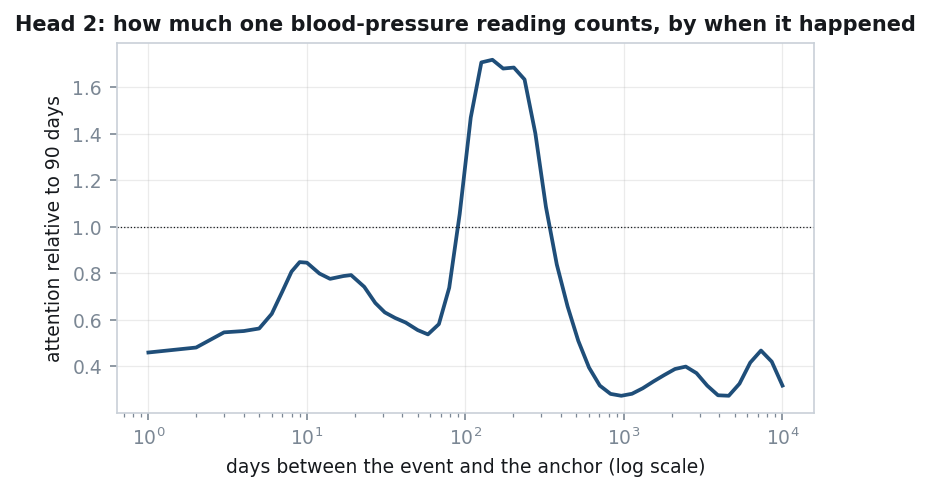
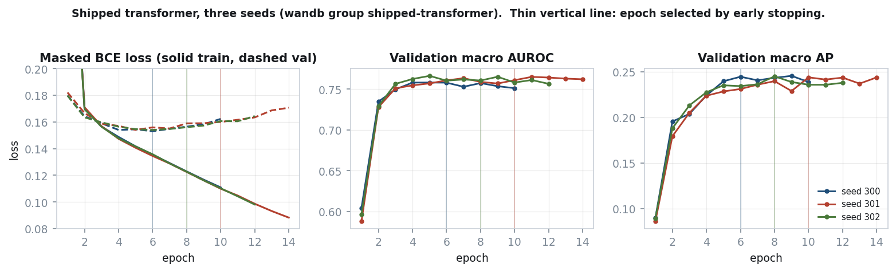
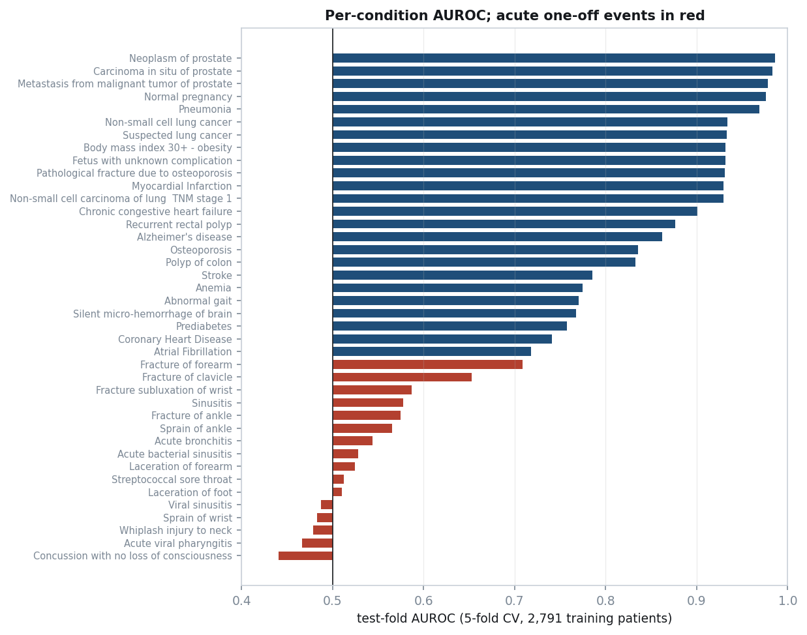

# Patient Timeline Forecasting on Synthea

**M31 Research Intern Take-Home**

The task: for each patient, predict which of 40 conditions are **first diagnosed** in the
five years after an anchor date (last encounter minus five years). Only events before the
anchor may be used. There are 3,514 synthetic patients, split 2,791 train / 365
validation / 358 test.

Code: [github.com/Sallamsaka/M31-Coding-Test](https://github.com/Sallamsaka/M31-Coding-Test) ·
model: [huggingface.co/sallamsaka/M31-Coding-Test](https://huggingface.co/sallamsaka/M31-Coding-Test) ·
training curves: [wandb project](https://wandb.ai/sallamsaka-university-of-toronto/m31-patient-timeline)
(runs [seed 300](https://wandb.ai/sallamsaka-university-of-toronto/m31-patient-timeline/runs/1nyu0iwr),
[seed 301](https://wandb.ai/sallamsaka-university-of-toronto/m31-patient-timeline/runs/s20y3qfg),
[seed 302](https://wandb.ai/sallamsaka-university-of-toronto/m31-patient-timeline/runs/saafguxm))

## Results

The test outcomes are withheld, so **test-set AUROC and mAP cannot be computed here**.
They are estimated instead by 5-fold cross-validation on the 2,791 training patients.
Each fold is scored by models trained on the other four. The provided splits are not
changed: validation patients are never trained on, and the transformer uses the
validation set only to pick its stopping epoch. Mean ± SD over the five held-out folds:

| model | macro AUROC | macro AP (mAP) |
|---|---|---|
| logistic regression (LR) | 0.7595 ± 0.0056 | 0.2077 ± 0.0192 |
| gradient-boosted trees (GBDT) | 0.7640 ± 0.0081 | 0.2260 ± 0.0185 |
| transformer (3 seeds) | 0.7661 ± 0.0065 | 0.2203 ± 0.0157 |
| average of the three, uncalibrated | 0.7747 ± 0.0057 | 0.2421 ± 0.0230 |
| **submitted: average of the three, calibrated** | **0.7755 ± 0.0028** | **0.2435 ± 0.0220** |

The submitted model is `sigmoid((logit LR + logit GBDT + logit transformer) / 3)`, followed
by a per-condition Platt map. The Brier score of the calibrated model is 0.04021, against
0.04147 uncalibrated. The last row's calibration is cross-fitted: each map is fitted on four
folds and scored on the fifth. On the provided validation set, which was used only for
monitoring, the submitted model scores 0.7742 AUROC and 0.2729 AP.

---

## 1. Representation

### One unit of input is one event

A patient is a time-ordered sequence of **events**, one position per event, taken from all
ten tables (conditions, medications, procedures, observations, immunizations, encounters,
careplans, allergies, devices, imaging studies). Each event becomes a token of the form
`KIND_code`, for example `MED_197361` or `COND_44054006`. A code enters the vocabulary if
at least 5 training patients have it; the 119 codes dropped this way are 0.075% of events.
The vocabulary is 1,105 tokens and is built from training patients only. Sequences are
capped at 512 events, keeping the most recent. The sequence ends in an `[ANCHOR]` token,
and the prediction is read from that position.

Why events rather than visits: one visit bundles about 20 simultaneous labs and vitals, and
observations are 62% of all events. Collapsing a visit into one vector throws away which
lab had which value.

### Lab values are fused into the token

A numeric lab becomes a single token that carries its level: `OBS_8480-6_Q7` is systolic
blood pressure in the 7th decile. The deciles are computed from training patients only.
This is used for the 57 labs common enough to support it. Rarer labs (0.76% of numeric
events) are followed by a shared level token `Q0`–`Q9`. Putting the value inside the token
rather than in a separate position makes sequences 37% shorter (median 259 tokens against
354) and carries the same information.

Text-valued answers (smoking status, the urinalysis panel) are kept as the code alone. I
tested adding the answer, and also fusing every lab into its token. Neither made a
measurable difference (§2).

### Time between events: continuous encodings, no position index

An event's index in the sequence says little about when it happened. The most recent event
before the anchor can be anywhere from 7 to 224 days old. Measured, the index carries 0.68
bits of the 4.99 bits of information in time-to-anchor, or 13.6%. So there are **no position
embeddings**. Each event instead gets two continuous time encodings (Time2Vec):

- **Time before the anchor**, `log(1 + days)`: one linear term plus 63 learned sine
  features. The log is needed because gaps span more than four orders of magnitude, up to
  37,284 days.
- **The patient's age at that event**, in decades, encoded the same way. This was added
  late, and it is the single largest transformer improvement measured (§2).

The token embedding (64 dimensions) and the two time encodings (64 each) are
**concatenated**, then projected back to 64 dimensions. They are not summed: summing makes
attention compare content against time through one shared projection.



The figure shows what the learned time encoding does. It plots how much attention one head
gives the same blood-pressure token depending only on how long before the anchor it was
recorded, relative to a reading 90 days old. A reading 100–300 days old gets up to 1.7×
the attention. Older than about two years, it drops to 0.3×. So the head has learned to
focus on the last annual check-up.

Events that share a timestamp (97.7% of events share one with at least one other) are
treated as simultaneous. Conditions carry a date with no time, so they are stamped at
midnight. For ordering only, they are moved onto the first encounter of the same day, so
that a diagnosis does not appear to come before the visit that made it. Labels never read
this adjusted timestamp (see "Labels" below).

### Tabular features, fused at the readout

The same patient is also summarised as 3,320 tabular features: code counts in several
time windows, last lab values, demographics, and age. LR and GBDT use them directly. The
transformer projects them to 128 dimensions and concatenates the result with its sequence
summary before the output layer.

### Labels, and what is refused

```
features:  ts <  anchor                       (right edge open)
label:     anchor <= first_dx <= anchor + 5y  (both edges closed)
first_dx = earliest diagnosis over the whole record
```

- **First diagnosis over the whole record.** Synthea re-records recurring conditions.
  Taking the earliest date *inside* the window would turn every recurrence into a false
  positive: 1,220 extra (patient, condition) pairs, inflating the 5,214 true positives by
  23.4%.
- **Right edge closed.** 119 first diagnoses fall exactly on `anchor + 5y`; an open edge
  would drop them. The organisers confirmed the window includes its final day.
- **Prevalent pairs.** A patient already diagnosed with a condition before the anchor
  cannot be newly diagnosed with it. These pairs are excluded from training and are set to
  the floor probability in the submission. No such pair has a positive label, in train or
  validation.
- **Refused columns.** `DEATHDATE` is filled for 1,354 training/validation patients and for
  none in test. `HEALTHCARE_EXPENSES` and `HEALTHCARE_COVERAGE` are lifetime totals, about
  512× a test patient's pre-anchor claims. Any duration built from `STOP` is also refused,
  because test stops after the anchor were blanked (4.41% null in test against 1.17% in
  train). The code refuses all of these at load time.
- Every fitted statistic (vocabulary, deciles, scalers, calibration) is fitted on training
  patients only. 152 automated tests cover the pipeline, including leakage and label
  checks.

The optional genomics and imaging modalities were not used. The brief says the structured
tables are enough, and every result here is limited by the number of patients, which
neither modality changes.

---

## 2. Model and training

### Architecture

| component | setting |
|---|---|
| input | token embedding (64) ‖ Time2Vec(time before anchor) (64) ‖ Time2Vec(age at event) (64) → linear 192→64 |
| trunk | 1 transformer layer, width 64, 2 heads of 32, MLP 64→256→64, pre-LayerNorm, no dropout |
| readout | output at `[ANCHOR]` (64) ‖ tabular features projected 3,320→128 with GELU |
| head | linear 192→40, one logit per condition |
| parameters | 565,628 |

With one layer, the causal mask has no effect: the prediction is read at `[ANCHOR]`, the
latest position, which sees every event under any mask. The model is effectively attention
pooling over a set of (event, time, age) items.

### Objective and training

- **Loss:** binary cross-entropy over the 40 conditions, with prevalent pairs masked out.
  The row still trains the shared trunk through its other conditions.
- **Optimiser:** AdamW, learning rate 1.2e-3, weight decay 0.001, 5% linear warm-up then
  cosine decay, batch 32 (grouped by sequence length), no dropout.
- **Stopping:** up to 30 epochs; early stopping on validation macro AP with patience 4
  (gains under 0.002 do not count).
- **Seeds:** three seeds (300, 301, 302), averaged in logit space.
- **LR:** C = 0.03 on log1p counts. **GBDT:** 300 trees, learning rate 0.05, 15 leaves,
  L2 1.0.

Hyperparameters were chosen on an inner split of the training patients (2,233 fit / 558
held out), not on validation. Later changes were chosen by the 5-fold procedure described
above.

### Training and validation curves



These are the three submitted seeds, logged to wandb (links at the top). Early stopping
picked epochs 5, 11 and 9. Validation loss is lowest around epochs 5–7 and then rises,
while training loss keeps falling (0.14 → 0.08). Validation AUROC and AP flatten from
epoch 5. The model overfits after a few epochs, which is expected with 2,791 patients.

### Experiments: one change at a time

I listed specific weaknesses of the model, then tested each fix as exactly **one change**
against the same baseline, on the same five folds (all 2,791 training patients scored out
of fold). The decision rule was written down before any result existed. A change is a
candidate if the bootstrap probability that it helps is at least 0.75 and the other metric
does not go down. A candidate is adopted only after it holds up on new seeds.

| change vs baseline (transformer alone, 1 seed) | Δ macro AP [95% CI] | Δ macro AUROC [95% CI] | result |
|---|---|---|---|
| **+ age at each event** | **+0.0100 [+0.0023, +0.0177]** | **+0.0098 [+0.0035, +0.0159]** | **adopted** |
| 4 heads of 16 instead of 2 of 32 | −0.0014 [−0.0071, +0.0049] | −0.0017 [−0.0057, +0.0028] | no |
| + embedding of the reason a drug was given | −0.0028 [−0.0105, +0.0029] | −0.0037 [−0.0086, +0.0016] | no |
| every lab fused into its token | +0.0023 [−0.0047, +0.0088] | −0.0032 [−0.0089, +0.0023] | no |
| + text answers (smoking, urinalysis) | +0.0006 [−0.0067, +0.0075] | −0.0036 [−0.0089, +0.0020] | no |
| 2 layers, on top of age (3 seeds) | −0.0029 [−0.0076, +0.0019] | −0.0013 [−0.0048, +0.0024] | no |

**Age was confirmed on two new seeds**, which played no part in choosing it. Over three
seeds it improves the transformer by +0.0143 AP [+0.0056, +0.0210] and +0.0114 AUROC
[+0.0061, +0.0166]. It improves the three-model average by +0.0056 AP [+0.0020, +0.0099]
and +0.0043 AUROC [+0.0020, +0.0064] (measured on the first three folds, which were the
only folds with LR and GBDT predictions at the time). It helped at every seed on both
metrics. Synthea's disease modules trigger on age, and with one layer the only age signal
before this was a single feature at the readout. Time before the anchor cannot tell
"first seen at 25" from "first seen at 55".

### Everything else that was tried

The table above is the last sweep. Earlier experiments, most of them run before
cross-validation existed and scored on validation (365 patients) or on a held-out slice of
the training patients. Differences under about 0.01 on those sets cannot be told apart.

| experiment | what changed | result | kept? |
|---|---|---|---|
| **feature fusion** (20-run designed experiment) | transformer also reads the 3,320 tabular features | **+0.053 AP**, the largest effect in the project | yes |
| learning rate (5 values) | 6e-4 → 1.2e-3 | +0.011 AP | yes |
| learning rate + fusion width together | 1.2e-3 with a 128-wide feature projection | +0.022 AP [+0.006, +0.037], 3 of 3 seeds | yes |
| seed averaging | mean of 3 seeds' logits | +0.013 AP | yes |
| dropout (designed experiment) | 0 vs 0.35 | −0.012 AP [−0.030, +0.006] (not resolvable, leans harmful) | no dropout |
| modality dropout | randomly hide the feature branch | 0.2418 vs 0.2474 AP | no |
| bigger model | 2 layers, width 128, 4 heads | −0.009 AP, 3 of 3 seeds | no |
| training to 30 epochs | no early stopping | −0.022 AP vs the stopped epoch | early stopping |
| weight averaging (EMA) | average weights over training | +0.003 AUROC, AP won 23 of 48 runs | no |
| time ablation (7 arms) | remove time signals one by one | order and time together are worth +0.030 AUROC; either signal alone was redundant | Time2Vec kept, gap bias later removed |
| causal vs bidirectional mask | attention direction | +0.015 AUROC [−0.003, +0.032] | causal |
| data augmentation (5 tests, 2 models) | extra examples from earlier cutoffs | null or harmful every time | no |
| LR feature blocks (6, factorial) | reasons, lab slopes, time since, cost, age residuals, dedup | largest effect 0.0006 | kept, inert |
| GBDT settings (screen + retest) | leaf size and others | effect reversed on retest | defaults |
| ensemble membership | which models to average | 3-model average best, +0.011 AP over best single | yes |
| logit vs probability averaging | how to average | 0.2755 vs 0.2635 AP | logit |
| grouping related conditions | share strength across a disease family | harmful, down to −0.024 AP | no |

### Pretraining, as the brief recommends

I pretrained the same model on next-event prediction, then fine-tuned it, and compared it
against the same model fine-tuned from scratch.

- **Pre-anchor events of training patients** (measured before age was added). The warm-up trains: next-event loss falls
  from 6.20 to 2.95, against 7.01 for a uniform guess. End to end it changes nothing:
  macro AP −0.0015 [−0.0339, +0.0309], AUROC +0.0009 [−0.0086, +0.0103]. It did learn
  something. A linear probe on the frozen trunk gets 0.1120 AP from the pretrained weights
  against 0.0996 from random ones. But supervised fine-tuning builds the same thing within
  a few epochs, from either start.
- **Whole training timelines**, including the 955,228 events after the anchor. For
  training patients these are legal, and they are exactly the dynamics the task asks
  about. Measured against the age model: AP −0.0041 [−0.0103, +0.0043], AUROC −0.0010
  [−0.0060, +0.0041]. Also a null.

The likely reason is that pretraining re-reads the same 2,791 patients. It adds no new
patients, and the number of patients is the binding constraint here.

### Combining the models and calibration

The transformer does not beat GBDT clearly on its own, but the two make different
mistakes. Averaged over conditions, the rank correlation of their out-of-fold scores is
0.574, against 0.639 for LR with GBDT and 0.753 for LR with the transformer. Averaging the three logits beats every single model on both metrics (table
at the top).

Averaging logits distorts probabilities: uncalibrated, the average predicts only 0.64×
as many diagnoses as actually happen. So each condition gets its own small correction,
`p = sigmoid(a · logit + b)` (Platt scaling, two numbers per condition). The 80 numbers are
fitted on the out-of-fold predictions of the 2,791 training patients, which are predictions
the models made for patients they had not seen. Measured by Brier score (the mean squared
error between the predicted probability and the 0/1 outcome; lower is better), the
correction takes the predictions from 0.04147 to 0.04021, when each fold's correction is
fitted on the other four folds. It also beat fitting the correction on the validation set.

`python -m src.reproduce --from-hub sallamsaka/M31-Coding-Test` rebuilds `predictions.csv`
from the published files. It matches the submitted file to 7.4e-08.

---

## 3. AI workflow

I used [tool] as an agent with access to my terminal. It wrote nearly all of the code,
ran every experiment and read the literature. My job was deciding what to research, what
to build, what counted as evidence, and what shipped. The project took 7 days and about
290 of my messages.

**Research at scale.** Before any modelling decision I had it do a literature search, and
I ran seven rounds of these. In each round it launched 3 to 20 research agents in parallel,
one per topic. Some of those agents launched their own sub-agents. Together they made about
2,500 web fetches and 900 searches, covering roughly 370 arXiv papers. 275 PDFs were read
page by page rather than summarised from abstracts. I asked for exact extractions, for
example "extract verbatim how BEHRT represents time", not overviews. Each round fed a
specific decision:

- EHR time encoding papers produced a written comparison of options. CEHR-BERT's result
  (adding time to token embeddings was worse than no time at all in 7 of 8 settings) is
  why time is concatenated, not summed.
- EHRSHOT and small-data benchmarks, where count features with gradient boosting match a
  large pretrained model at our cohort size, are why LR and GBDT were built as serious
  competitors rather than token baselines.
- Delphi-2M's use of age alongside time is the precedent for age at each event.
- The statistics literature (sample-size criteria, test-set reuse, multiple comparisons)
  is why every result here has an interval and why models are selected by
  cross-validation.

Rounds were usually started because I thought a plan rested on intuition: "some of ur
decisions are just random or intuitive, not rly rigorous".

**Planning before code.** Every non-trivial step started as a written plan I had to
approve. It proposed 42 plans. I sent 28 back with changes, and one was revised ten times
before I accepted it. Each plan had to list the options with estimated effect and cost,
rank them, and argue against its own favourite. I also had separate review agents attack a
plan before I saw it. Before long unattended runs, the expected outcome and the adoption
rule were written into the repository first, so a result could not be reinterpreted after
the fact. The final sweep in §2 was run this way.

**Unattended runs.** Training is CPU-only and a transformer configuration takes 15 to 60
minutes, so the heavy work ran overnight: eight unattended windows in total. It wrote job
chains that waited for one stage to finish before starting the next, retried failures
three times, and resumed from saved checkpoints. The designed experiment, the
cross-validation, pretraining and the final sweep all ran while I slept, and I reviewed
the results in the morning.

**Keeping it on track across sessions.** The assistant's working memory ran out and was
compressed about 30 times. I set up four things so that nothing settled was lost or
redone, starting from a best-practices guide I gave it:

- *A knowledge file.* One document with every measured number and every decision. It is
  now about 5,600 lines. Each new session read it first.
- *A rules file.* A short list it reads at the start of every session, for example "never
  change the provided splits" and "no result without an interval".
- *Two automatic checks on its actions.* One stopped it from running a background job in
  a way that hid the job's output (this had wasted whole runs). The other stopped it from
  finishing a task while tests were failing.
- *Two checklists.* One for running an experiment, one for publishing. Each step is there
  because it had failed at least once.

It also wrote the audit and diagnostic scripts, the 152 tests, the figures (every number
traced to the script that produced it), the Hugging Face upload, the reproduction script
and the wandb logging.

**Learning the model through it.** I had not trained a transformer from scratch before.
So I made it teach me the shipped model from the inputs up, and I rejected summaries and
analogies until it traced one real patient through the saved weights. Its hand
calculation matched the model to 4.8e-07. That walkthrough is where the adopted change
came from. It showed that the model had no sense of the patient's age at each event, and
that the time-gap attention bias did nothing.

**Where my input mattered.** Some ideas were mine: fusing every lab consistently, keeping
text answers, pretraining on events after the anchor, a schedule-free optimiser from
another project of mine, and one calibration rule for all 40 conditions. I also rejected
its evaluation design, which held a fixed slice of training patients out as a private test
set while the given validation set went unused. What replaced it is the rotating 5-fold
cross-validation used for every number in this report. It drafted the two clarifying
questions I sent to the assignment owner, one of which confirmed the label window.

**Its main weakness** was stating numbers from memory as if measured: a parameter count
off by 40%, a seed variance off by 10×. The rule that fixed this was that every claim must
reproduce from a file or a run.

---

## 4. Interpretation



Per-condition AUROC ranges from 0.44 to 0.99. The spread follows one question: **does
Synthea generate this condition from something recorded before the anchor?** To check
this, I scored each condition with two single variables as well as the model, all on the
out-of-fold predictions: age at the anchor, and whether the patient dies (known for
training patients, and used here only as a diagnostic).

**Conditions tied to death: 0.90–0.99.** CHF, myocardial infarction, pneumonia, the
lung-cancer trio and the prostate trio. For these, whether the patient dies alone gives
AUROC 0.78–0.80. Chronic CHF is newly diagnosed in 19.2% of patients who die and 0.3% of
those who don't. The reason is how the anchor is defined. It is five years before the last
encounter, and 43% of training patients have a death date, all within 30 days of the
window's end. For those patients the outcome window is their last five years of life, and
the diseases that kill them are diagnosed inside it.

The model never sees the death date, but it does not need to: **the anchor's calendar
date gives death away.** Patients still alive at the end of the data have a last encounter
near the data export, so their anchor falls in 2016. Patients who died have an anchor five
years before their death, anywhere from 1917 to 2016. Of training patients anchored in
2016, 1,119 of 1,131 are alive. Of those anchored earlier, 1,187 of 1,660 died. The anchor
date alone predicts death at AUROC 0.99. The features carry the calendar era indirectly,
and logistic regression on them predicts death at 0.991 out of fold. This is not leakage:
the test anchors are given to us, were made by the same rule, and follow the same date
pattern (57% anchored before 2016, against 60% in train).

So is the model only learning "this record is about to end"? No. It also learns *which
disease* will end it. In Synthea these diagnoses almost only happen in dying patients:
pneumonia 133 of 133 positives, CHF 224 of 229, myocardial infarction 151 of 153, lung
cancer 74 of 76. Scoring the model **only among patients who die** removes the "about to
end" signal entirely, and it still ranks them well: pneumonia 0.927, prostate neoplasm
0.970, myocardial infarction 0.862, lung cancer 0.850, CHF 0.767, stroke 0.697. So the
score has two parts. The anchor date says *whether* the patient is in their last five
years (death alone gives 0.78–0.80). The history (age, sex, chronic conditions, labs)
says *what* they will die of. In a real hospital the first part would not exist, because
real follow-up does not end at death by construction.

**Conditions gated by age or sex: 0.93–0.98.** Normal pregnancy (age alone: 0.087, so
younger means more likely, and only women), obesity, the prostate conditions (men only).
These are close to deterministic given demographics and a few codes, and they lift the
macro average.

**Conditions that grow with age: 0.72–0.86.** Osteoporosis, Alzheimer's, stroke, atrial
fibrillation. Age alone gets 0.75–0.78, and the model adds a little on top.

**Acute, random events: 0.44–0.71, sixteen conditions.** Sinusitis, pharyngitis,
bronchitis, sprains, lacerations, whiplash, concussion. Here age scores 0.41–0.66, death
scores 0.43–0.57, and the positive rate is the same in patients who die and those who
don't (viral sinusitis 44.1% vs 45.5%). As far as the recorded history shows, these are
random draws, so no model can rank them. Five score below 0.5 (0.44–0.49). Concussion's
0.44 on 69 positives is about 1.7 standard errors below chance, so this is weak evidence
at most, and the cause is not established. The calibration maps flip these five, because
the flip held on the training folds; it is a small effect either way. Fractures in older patients (forearm, clavicle)
do better, because age predicts them.

**Why macro AP is low.** AP depends on prevalence, and most of these conditions are rare:
median prevalence among at-risk patients is 3.3%, while the most common, viral sinusitis,
is 45%. Lift over prevalence is a fairer comparison. It is 16–27× for the prostate trio
and 0.8–1.4× for the acute events.

**Two caveats on the macro average.** Several labels are near duplicates. Abnormal gait
and silent micro-haemorrhage of the brain have the same 41 positives (φ = 1.000), and the
lung-cancer trio correlates at 0.94–0.99. So there are about 35 independent problems, not
40. And Synthea is not real EHR data: a classifier separates it from MIMIC at AUC 0.999,
and its diseases follow simple rule-based modules. How easy each condition is here says
little about how easy it would be in a real hospital.
